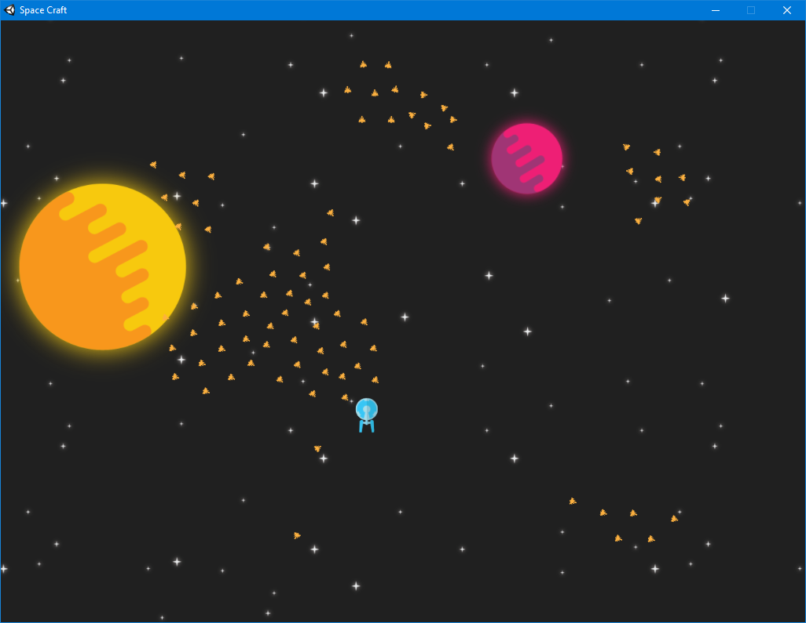

Boids
=====

Giới thiệu
----------

- Là mô hình được xây dựng để mô phỏng lại tập tính bầy đàn của động vật

- Được phát triển vào năm 1986, trong điều kiện là các chương trình mô phỏng còn hạn chế. Thường không có các tác nhân như lực tác động hay tính toán va chạm

- Mô hình chỉ đơn giản là mô tả làm sao cho giống chuyển động của bầy cá hoặc bầy chim trong tự nhiên

Mô tả
-----

Boids là một tác tử đại diện cho một con vật trong đàn

Mỗi tác tử trên tuân theo ba luật lệ sau:

- **Separation** : Lái nghiêng đi để tránh đám đông

- **Aligment** : Hướng về hướng chung của bầy đàn

- **Cohension** : Bay sát về phía trung tâm của bầy đàn

Mỗi tác tử có khả năng truy cập trực tiếp vào tất cả yếu tố đồ họa của khung hình. Tuy nhiên tập tính bầy đàn chỉ có phép tác tử phản ứng cục bộ ở bên trong vùng lân cận.

Vùng lân cận được xác định bởi một bán kính khoảng cách xung quanh tác tử và góc nhìn (trừ đi khoảng mù phía sau của tác tử đó).

Pseudocode
----------

> Nguồn: [KFish]

Trong mỗi khung hình chương trình sẽ thực hiện hai công việc:

- `draw_boids()`: Vẽ các tác tử đại diện cho động vật
- `move_all_boids_to_new_positions()`: Di chuyển các tác tử tới vị trí mới

```
initialise_positions()
	
LOOP
	draw_boids()
	move_all_boids_to_new_positions()
END LOOP
```

Việc di chuyển các tác tử tới vị trí mới phải tuân theo ba luật lệ là `rule1, rule2, rule3`. Kết quả thu được là ba vector vận tốc `v1, v2, v3`.

Vận tốc của tác tử `Boid b` sẽ bằng tổng của vận tốc ban đầu cộng với vận tốc thu được từ việc thực hiện ba luật trên. Sau đó vị trí của các tác tử sẽ được cập nhật

```
PROCEDURE move_all_boids_to_new_positions()

	Vector v1, v2, v3
	Boid b

	FOR EACH BOID b
		v1 = rule1(b)
		v2 = rule2(b)
		v3 = rule3(b)

		b.velocity = b.velocity + v1 + v2 + v3
		b.position = b.position + b.velocity
	END

END PROCEDURE
```

**Luật thứ 1**: Các tác tử sẽ cố gắng bay để tránh đám đông

Tác tử sẽ cố gắng bay tránh những tác tử ở gần mình

```
PROCEDURE rule1(boid bJ)

	Vector c = 0;

	FOR EACH BOID b
		IF b != bJ THEN
			IF |b.position - bJ.position| < 100 THEN
				c = c - (b.position - bJ.position)
			END IF
		END IF
	END

	RETURN c

END PROCEDURE
```

**Luật thứ 2**: Các tác tử sẽ bay theo hướng của cả đàn

```
PROCEDURE rule2(boid bJ)

	Vector pvJ

	FOR EACH BOID b
		IF b != bJ THEN
			pvJ = pvJ + b.velocity
		END IF
	END

	pvJ = pvJ / N-1

	RETURN (pvJ - bJ.velocity) / 8

END PROCEDURE
```

**Luật thứ 3**: Các tác tử sẽ cố gắng bay sát theo đàn, hướng về tâm của đàn

```
PROCEDURE rule1(boid bJ)

	Vector pcJ

	FOR EACH BOID b
		IF b != bJ THEN
			pcJ = pcJ + b.position
		END IF
	END

	pcJ = pcJ / N-1

	RETURN (pcJ - bJ.position) / 100

END PROCEDURE
```

Ngoài ra chúng ta cũng có thể cài đặt thêm các tính năng là bay theo tác tử dẫn đầu hoặc bay theo mục tiêu nhất định, tránh gió

Cải tiến
--------

Vì trong phát biểu của mình về mô hình `boids` tác giả cũng không nói rõ về cách thức hoạt động và mô hình vật lý mà chỉ đưa ra phát biểu tương đối nên chúng ta cũng có thể dựa vào các luật trên để cải tiến thuật toán như sẽ nêu trong phần demo

Demo
----

> Demo được xây dựng dựa trên [Flocking Fish Demo]



Chương trình demo mô phỏng tập tính bầy đàn như trong mô hình `boids` tuy nhiên có nhiều thay đổi

Giống như trong mô hình `boids` demo cũng xây dựng các tác tử dựa trên mô hình luật:

- **Separation**: Các tác tử không được bay quá gần nhau
- **Cohension**: Các tác tử có khả năng kết hợp với những tác tử bay xung quanh tạo thành đàn
- **Aligment**: Các tác tử sẽ cố gắng bay cùng hướng đối với các tác tử cùng đàn

- **Persuit**: Các tác tử có khả năng bay theo đuổi mục tiêu
- **Avoid Obstacles**: Tránh chướng ngại vật từ xa

Những khó khăn gặp phải:

- Một là khác với các mô hình `boids` khác mô hình boids trong demo có đưa các yếu tố vật lý là va chạm giữa các tác tử vào. Do đó việc lập trình cho tác tử sẽ khó hơn

- Hai là hình dạng các tác tử cũng rất đặc biệt (hình tam giác). Vì vậy hai tác tử bay theo cùng một hướng nếu va chạm thì đầu chúng sẽ chếch về phía nhau rất khó tách ra. Vấn để tương tự cũng xảy ra khi tác tử va vào chướng ngại vật

Demo sử dụng những phương pháp sau đây

**Xác định vận tốc**

Mỗi tác tử sẽ có hai vector vận tốc một là vector vận tốc mong muốn `targetVelocity` hai là vector vận tốc thực tế `velocity`

Dựa vào các luật chúng ta có thể tính được vector `targetVelocity`. Tuy nhiên vector này có thể cùng phương, có thể khác phương với chuyển động của của tác tử. Vector này cũng có thể cùng chiều, cũng có thể ngược chiều với phương chuyển động. Giá trị của vector này cũng có thể vượt quá vận tốc tối đa mà tác tử có thể chuyển động

Trong khi đó tác tử chỉ có thể chuyển động thẳng với vector vận tốc tiếp tuyến và quay sử dụng vector quay

Do đó để tính toán vận tốc thực tế chúng ta làm như sau

- Giới hạn độ lớn của `targetVelocity`

- Tính toán độ lớn của vector tiếp tuyến bằng cách lấy hình chiếu. Thực tế của việc lấy hình chiếu là nhân với `cos` góc xen giữa. Tuy nhiên việc này lại gây ra vận tốc âm. Do đó thực tế chúng ta sẽ tính bằng công thức `(cos(alpha) + 1) * |targetVelocity|` sẽ ra vận tốc tiếp tuyến. Nhờ đó vận tốc tiếp tuyến sẽ không âm

- Góc quay tỉ lệ thuận với góc xen giữa và bị giới hạn bởi tốc độ quay tối đa

Việc tính `targetVelocity` được mô tả dưới đây

**Duy trì khoảng cách giữa các tác tử**

Mỗi tác tử sẽ xác định một bán kính lân cận và một khoảng cách an toàn

Tác tử sẽ duy trì khoảng cách với các tác tử khác trong vùng lân cận bằng một vận tốc duy trì

Vận tốc duy trì là hàm phụ thuộc vào hiệu giữa `khoảng cách từ tác tử này đến tác tử kia` và `khoảng cách an toàn`

Việc cài đặt hàm này thế nào phụ thuộc vào chúng ta. Độ biến thiên càng lớn thì khả năng duy trì khoảng cách an toàn càng cao

**Sắp xếp để cùng hướng với các tác tử xung quanh**

Vận tốc sắp xếp này thường được tính là bằng vận tốc trung bình của các tác tử xung quanh nó. Tuy nhiên việc này dẫn đến việc vận tốc bị gấp đôi lên theo lũy thừa. Do đó nên vận tốc này thường được nhân với một tỉ lệ phần trăm nào đó

**Tránh chướng ngại vật**

Việc xây dựng khả năng tránh vật cản cho tác tử tương tự như việc chúng ta xây dựng khả năng duy trì khoảng cách cho các tác tử. Khi tác tử nhận thấy nó tới gần chướng ngại vật nào đó. Nó có thể tính toán một vận tốc đẩy cùng phương với đường nối tâm từ vật cản tới tác tử. Độ lớn của vector phụ thuộc vào khoảng cách giữa tác tử và vật cản

**Đuổi theo mục tiêu**

Vận tốc đuổi theo mục tiêu nên được đặt là vận tốc cố định vào có hướng từ tác tử tới mục tiêu

Vận tốc mong muốn `targetVelocity` sẽ được tính bằng tổng các vận tốc trên cộng lại

Mã nguồn của demo có thể tham khảo tại: [Boids Demo]

[Boids Demo]: https://github.com/clitetailor/BoidsDemo

Reference
---------

Homepage: [red3d]

[red3d]: http://www.red3d.com/cwr/boids/

Wiki:

- [Boids]

[Boids]: https://en.wikipedia.org/wiki/Boids

Pseudocode:

- [KFish]

[KFish]: http://www.kfish.org/boids/pseudocode.html

Source code:

- [Flocking Fish Demo]

[Flocking Fish Demo]: https://www.youtube.com/watch?v=eMpI1eCsIyM