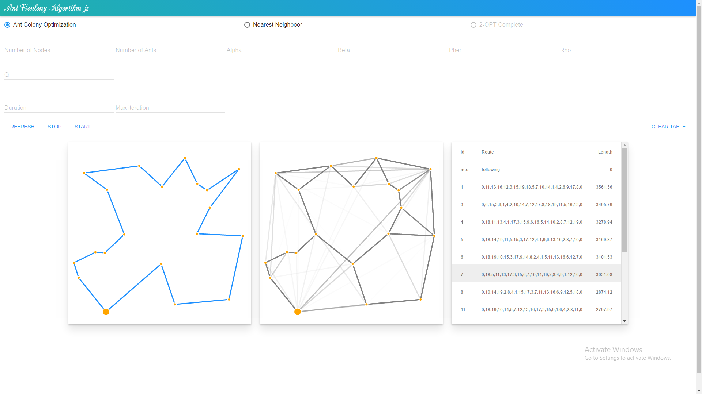
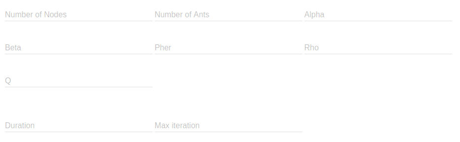
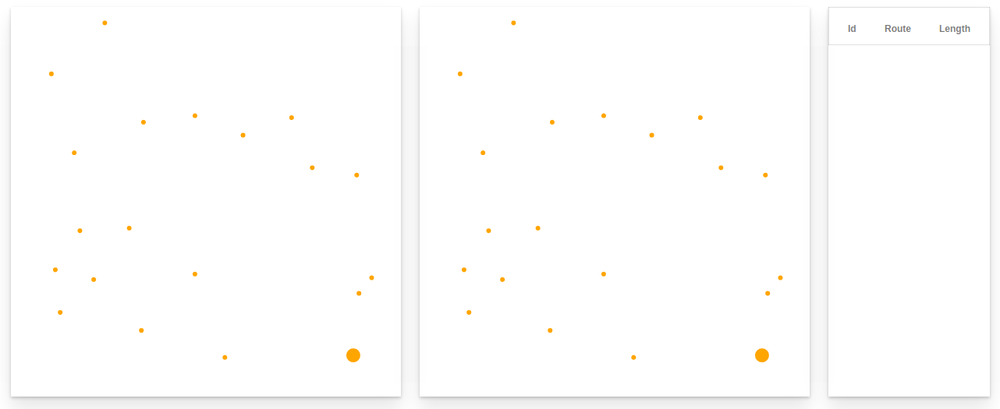

Demo
====

Giới thiệu
----------

Chương trình là demo của thuật toán Ant Colony Optimization (ACO) trên nền bài toán Travelling Salesman Problem (TSP)

Bên cạnh đó chương trình cũng lấy hai thuật toán là Nearest Neighbor (NN) và 2-OPT Complete để làm tiêu chuẩn so sánh

Demo được xây dựng dựa trên demo [aco-js] của GordyD


Giao diện chính của chương trình
--------------------------------



Lựa chọn thuật toán
-------------------


Các giá trị cài đặt cho thuật toán ACO
--------------------------------------



Nếu bị bỏ trống chương trình sẽ chạy với các giá trị mặc định sau

```
+ Số đỉnh: 20
+ Số con kiến: 20
+ Alpha: 1, Beta: 1
+ Rho: 0.1
+ Q: 100

+ Iteration: 200
+ Duration: 100
```

Hiển thị kết quả
----------------



Phần hiển thị kết quả gồm có 3 ô với nhiệm vụ của từng khung là:
  - Ô bên trái hiển thị tuyến đường.
  - Ô ở giữa hiển thị giá trị pheromone trên các tuyến đường.
  - Ô bên phải là bảng các tuyến đường và chi phí tương ứng.

Ta có thể kích vào dòng bất kì để hiển thị lại tuyến đường của dòng đó.

Các phím chức năng
------------------

- **Refresh**: Khởi tạo lại sử dụng khi số đỉnh thay đổi
- **Stop**: Dừng lại sử dụng khi thuật toán ACO chạy quá lâu
- **Start**: Để bắt đầu thực hiện Demo

- **Clear Table**: Xóa bảng lưu trữ tuyến đường khi bảng quá dài và chứa nhiều dữ liệu cũ

Tài liệu tham khảo
==================

Research Gate:

- [High-level pseudo-code for the ACO algorithm]

[High-level pseudo-code for the ACO algorithm]: https://www.researchgate.net/figure/5842413_fig2_Figure-3-High-level-pseudo-code-for-the-ACO-algorithm

- [Using Ant Colony Optimization (ACO) on Kinetic Modeling of the Acetoin Production in Lactococcus Lactis C7]

[Using Ant Colony Optimization (ACO) on Kinetic Modeling of the Acetoin Production in Lactococcus Lactis C7]: https://www.researchgate.net/figure/237013254_fig1_Fig-1-Pyruvate-metabolisms-in-lactococcus-lactis-C7-Marcel-et-al-2002

Wiki:

- [Ant]

[Ant]: https://en.wikipedia.org/wiki/Ant

- [Travelling salesman problem]

[Travelling salesman problem]: https://en.wikipedia.org/wiki/Travelling_salesman_problem

- [Ant colony optimization algorithms]

[Ant colony optimization algorithms]: https://en.wikipedia.org/wiki/Ant_colony_optimization_algorithms

Source-code:

- [aco-metaheuristic]

[aco-metaheuristic]: www.aco-metaheuristic.org/aco-code/

- [aco-js]

[aco-js]: https://github.com/GordyD/js-aco


