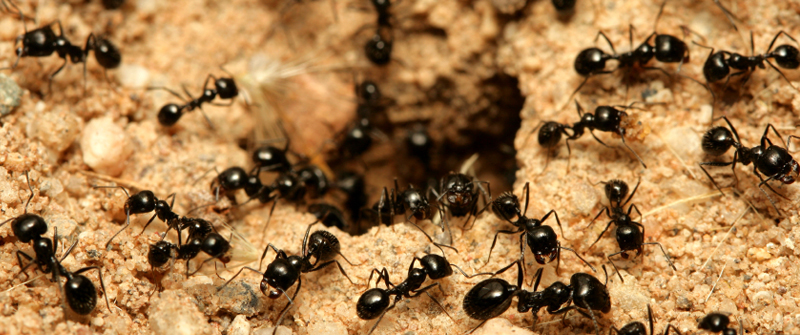

<!--
page_number: true
$theme: gaia
template: gaia
$size: A4
-->

Swarm Intelligence
====================

Giáo viên hướng dẫn: **Thân Quang Khoát**

Nhóm số 5:

1. Nguyễn Quốc Anh  
  `MSSV: 20140149`

2. Phùng Đức Nhật  
  `MSSV: 20143321`

3. Lưu Minh Hồng
  `MSSV: 20169572` 


---

<!--
template: default
-->

Tại sao lại sử dụng mô hình swarm intelligence?
-----------------------------------------------


<!--
- Mô phỏng lại dựa trên mô hình trong tự nhiên
- Sử dụng mô hình để giải bài toán thực tế
-->

---

<!--
template: gaia
-->

Swarm Intelligence
------------------

- Mô hình đa tác tử

- Dựa vào tập tính bầy đàn trong tự nhiên


- Ba hướng phát triển chính của Swarm Intelligence:

  + Swarm Robotic
  + Computer Graphic
  + Tìm kiếm đồ thị


---

<!--
template: default
-->

Mô phỏng lại dựa trên mô hình thực tế trong tự nhiên
----------------------------------------------------


---

Sử dụng mô hình để nâng cao hiệu năng
-------------------------------------

- Thuật toán Stochastic Diffusion Search
  (Bishop 1989)

- Thuật toán Ant Colony Algorithm - _ACO_
  (Dorigo 1992)

- Particle swarm optimization
  (Kennedy, Eberhart & Shi 1995)

---

<!--
template: gaia
-->

Ant Colony Optimization Algorithms
--------------

---

<!--
template: default
-->


Ant Colony Optimization
-----------------------

- Được Marco Dorigo đề xuất năm 1992

- Áp dụng kĩ thuật trong tính toán xác suất vào bài toán tìm kiếm đồ thị

---
<!--
template: gaia
-->

Ant Colony Optimization
-----------------------

$$
AS \Rightarrow ACO \Rightarrow \left\{
				\begin{array}{ll}
					Elitist \space Ant \space System\\
					\\
                    MMAS\\
                    \\
					Ant \space Colony \space System (ACS)\\
                    \\
					ASrank\\
                    \\
                    Continuous \space orthogonal \space ant\\
                    colony \space (COAC)\\
				\end{array}
			\right.
$$

---

<!--
template: default
-->

Mô hình Ant System - _AS_
------------------------

Đặc trưng của loài kiến

- Có tập tính bầy đàn

- Giao tiếp hạn chế thông qua va chạm hoặc pheromone

---

Mô hình Ant System
------------------

Mô tả:

- Cho một tổ kiến cùng với thức ăn ở xung quanh

- Lần lượt gửi kiến đi tìm thức ăn

- Kiến sẽ di chuyển ngẫu nhiên đến khi tìm được thức ăn

- Nếu tìm thấy thức ăn sẽ đưa thức ăn về tổ

- Trên đường đưa về tổ sẽ thả chất pheromone để đánh dấu đường đi

- Lượng pheromone nhả ra phụ thuộc vào thức ăn

<!-- Có thể optimize được quãng đường -->

---

<!--
template: default
-->

Mô hình Ant System
------------------

- Những con kiến khác đi qua pheromone sẽ đi theo pheromone

- Càng nhiều kiến đi theo thì pheromone trên tuyến đường các tăng

- Lượng pheromone càng nhiều thì càng hấp dẫn các con khác đến

- Khi lượng thức ăn hết thì pheromone sẽ bay hơi dần

---

<!--
template: gaia
-->

Mô hình Ant System
-------------------



---


<!--
template: default
-->


Mô hình Ant System
------------------


- Khó triển khai

- Không phù hợp với các bài toán thực tế
 
---

Mô hình Ant Colony Optimization - _ACO_
---------------------------------------

- Được tạo ra với mục đích riêng

- Giải bài toán Travel Saleman Problem (TSP)

- Là thuật toán tối ưu hóa (Optimization)

- Tận dụng ưu điểm của phép toán ngẫu nhiên cùng với tập tính bầy đàn, khả năng giao tiếp giữa các tác tử

---

<!--
template: gaia
-->

Travelling Saleman Problem - _TSP_
------------------------------

- Một người đưa pizza phải giao pizza cho tất cả các khách hàng rồi quay trở về hàng ăn sao quãng đường là ngắn nhất

- Giả sử luôn tồn tại đường đi giữa hai địa chỉ cần giao hàng

---

Travelling Saleman Problem - _TSP_
------------------------------


---


<!--
template: default
-->

Thuật toán
----------

- Extract Algorithm

- Nearest Neighbor

- Christofides' algorithm for the TSP

- 2-OPT Complete

- Ant Colony Algorithm

---

Nearest Neighbor - _NN_
------------------------

- Tại mỗi điểm chọn ra điểm gần nhất và thăm điểm đó


---

Nearest Neighbor
----------------

Ưu điểm:

- Đơn giản, dễ cài đặt

- Chi phí thấp nhưng vẫn hiệu quả

Nhược điểm:

- Đoạn đường xuất phát chi phí thấp nhưng đến cuối chi phí cao dần

Giải pháp:

- Chọn nốt gốc là các nốt khác nhau để giải

---


<!--
template: gaia
-->

Ant Colony Optimization
-----------------------

Pseudo code:
```
1. xác định số con kiến

2. khởi tạo pheromone

3. thực hiện lặp một số vòng nhất định

	- giải bài toán
	
	- cập nhật tuyến đường chi phí thấp nhất
    
	- cập nhật lại pheromone cho mỗi tuyến đường
```

---

<!--
template: default
-->

Ant Colony Optimization
-----------------------
Trọng số của một cạnh:

---

<!--
template: default
-->

Ant Colony Optimization
-----------------------

Trọng số của một cạnh:

- Phụ thuộc vào pheromone

- Phụ thuộc vào độ dài cạnh

---

Ant Colony Optimization
-----------------------

Công thức tính trọng số:

$$ weight_{xy} = \tau_{xy} * \eta_{xy} $$

- $\tau$ : lượng pheromone

- $\eta$ : nghịch đảo khoảng cách $\frac{1}{d}$

Tổng quát:

$$ weight_{xy} = \tau_{xy}^\alpha * \eta_{xy}^\beta $$

---

So sánh giữa ACO và NN
----------------------

- Vòng lặp đầu tiên pheromone sẽ được khởi tạo bằng nhau và bằng 1

- Trọng số là $\frac{1}{d}$ giống với NN

- Trong NN cạnh có khoảng cách nhỏ nhất được chọn. Trong ACO cạnh sẽ được chọn ra ngẫu nhiên. Trọng số cao hơn có sắc xuất cao hơn

- Trong NN một lần giải sẽ tìm ra một tuyến đường. Trong ACO một lần sẽ có một số lượng kiến đi tìm các đường khác nhau

<!--

Ant Colony Optimization
-----------------------

Trong số các tuyến đường nối đến các đỉnh còn lại

- **NN** : tại mỗi nốt chọn tuyến đường ngắn nhất

- **ACO** : các tuyến đường được lựa chọn ngẫu nhiên, tuyến đường có trọng số cao hơn thì xác suất cao hơn

-->

---

Ant Colony Optimization
-----------------------

Xác suất được chọn của một cạnh bất kì được tính theo công thức:

$$ P_{ij} = \frac{weight_{ij}}{\sum_{k \in unvisited}{} weight_{ik}} $$

- $i$ : id của đỉnh hiện tại

- $j$ : id của một đỉnh bất kì chưa thăm

- $unvisited$ : tập các đỉnh chưa thắm

---


Ant Colony Optimization
-----------------------

- Thuật toán thực hiện nhiều chu kì

- Mỗi chu kì sẽ cho một số lượng kiến đi khám phá các tuyến đường

- Các các cạnh của tuyến đường sẽ được chọn ngẫu nhiên với xác suất nêu trên

- Kết thúc sẽ thu được kết quả là các tuyến đường tương ứng với số kiến đã gửi đi

- Sau chu kì thì pheromone trên các tuyến đường sẽ được cập nhật lại

---

Ant Colony Optimization
-----------------------

Cuối mỗi vòng lặp pheromone được cập nhật lại:

- pheromone sẽ bay hơi đi với tỉ lệ là $\rho$

$$ \tau_{xy} = (1 - \rho) * \tau_{xy} $$

$\tau$ : lượng pheromone

$x, y$ : id của các đỉnh của đồ thị

---

Ant Colony Optimization
-----------------------

- Mỗi con kiến sẽ nhả ra trên mỗi cạnh mà nó đi qua một lượng pheromone
- Lượng pheromone nhả ra phụ thuộc vào độ dài của cả tuyến đường

$$ pheromones_{xy}^k = \frac{Q}{L_k} \forall x, y \in nodes|k \in ants $$

  + $Q$ là hằng số
  + $L_k$ là độ dài tuyến đường của con kiến thứ $k$

---

So sánh giữa ACO và NN
----------------------

NN:

- Chỉ cho ra lời giải duy nhất

- Kết quả thu được không phụ thuộc vào thứ tự thực hiện của lần giải đó mà chỉ phụ thuộc vào việc chọn nốt nào làm nốt gốc

- Chi phí chỉ tối ưu một cách cụ bộ

---

So sánh giữa ACO và NN
----------------------

ACO:

- Trọng số thay đổi từng lần giải

- Lần giải sau thường cho kết quả tốt hơn lần giải trước

- Số vòng lặp phụ thuộc vào lập trình viên

---

Ant Colony Optimization
-----------------------

Ưu điểm:
- Có thể đưa ra nhiều lời giải có chi phí tương đương

- Lượng pheromone thay đổi giúp tối ưu hóa tuyến đường theo từng chu kì

- Cách thức tiếp cận bài toán đơn giản. Có thể áp dụng vào các bài toán khác nhau

---

Ant Colony Optimization
-----------------------

Nhược điểm:

- Thuật toán phức tạp đối với những người chưa biết đến nó

- Hiệu suất giảm khi độ phức tạp bài toán tăng

Giải pháp

- Ant Colony System

---

Min-max Ant System
------------------

- Khi pheromone giảm xuống 0 xác suất được chọn của tuyến đường bằng 0. Tuyến đường không bao giờ được chọn

- Khống chế pheromone $(\tau_{min}, \tau_{max})$

---

Application
-----------

- Ứng dụng vào các bài toán tìm kiếm

  + Tìm kiếm trên bản đồ
  + Bài toán vận tải, mạng thông tin

- Ứng dụng trong các chương trình đồ họa

  + Strategy game
  + Mô phỏng lại tập tính bầy đàn trong tự nhiên

---

Demo
----

Ứng dụng mô phỏng ACO và NN trên bài toán TSP

Các input là các giá trị cài đặt cho thuật toán. Nếu không nhập các giá trị này sẽ ở giá trị mặc định:

	+ Số đỉnh: 20
	+ Số con kiến: 20
	+ Alpha: 1, Beta: 1
	+ Rho: 0.1
	+ Q: 100

	+ maxIteration: 200
	+ duration: 100

---

Demo
----

- Ô bên trái hiển thị tuyến đường
- Ô ở giữa hiển thị giá trị pheromone trên các tuyến đường
- Ô bên phải là bảng các tuyến đường và chi phí tương ứng
  
  + Có thể kích vào dòng bất kì để hiển thị lại tuyến đường của dòng đó

---

Demo
----

- Các nút điều khiển:

  + **Refresh**: Khởi tạo lại sử dụng khi số đỉnh thay đổi
  + **Stop**: Dừng lại sử dụng khi thuật toán ACO chạy quá lâu
  + **Start**: Để bắt đầu thực hiện Demo

  + **Clear Table**: Xóa bảng lưu trữ tuyến đường khi bảng quá dài và chứa nhiều dữ liệu cũ

---

Reference
---------

Research Gate:

- [High-level pseudo-code for the ACO algorithm]

[High-level pseudo-code for the ACO algorithm]: https://www.researchgate.net/figure/5842413_fig2_Figure-3-High-level-pseudo-code-for-the-ACO-algorithm

- [Using Ant Colony Optimization (ACO) on Kinetic Modeling of the Acetoin Production in Lactococcus Lactis C7]

[Using Ant Colony Optimization (ACO) on Kinetic Modeling of the Acetoin Production in Lactococcus Lactis C7]: https://www.researchgate.net/figure/237013254_fig1_Fig-1-Pyruvate-metabolisms-in-lactococcus-lactis-C7-Marcel-et-al-2002

---

Reference
----------

Wiki:

- [Ant]

[Ant]: https://en.wikipedia.org/wiki/Ant

- [Travelling salesman problem]

[Travelling salesman problem]: https://en.wikipedia.org/wiki/Travelling_salesman_problem

- [Ant colony optimization algorithms]

[Ant colony optimization algorithms]: https://en.wikipedia.org/wiki/Ant_colony_optimization_algorithms

---

Reference
---------

Sourcecode:

- [aco-metaheuristic]

[aco-metaheuristic]: www.aco-metaheuristic.org/aco-code/

- [aco-js]

[aco-js]: https://github.com/GordyD/js-aco

---

<!--
template: gaia
-->

Thanks for listening
====================