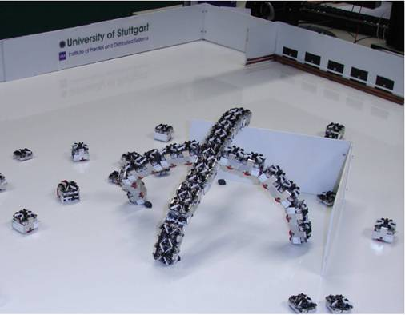

<!--
page_number: true
$theme: gaia
template: gaia
$width: 1920
$height: 1200
-->

Swarm Intelligence
====================

Giáo viên hướng dẫn: **Thân Quang Khoát**

Nhóm số 5:

1. Nguyễn Quốc Anh  
  `MSSV: 20140149`

2. Phùng Đức Nhật  
  `MSSV: 20143321`

3. Lưu Minh Hồng
  `MSSV: 20169572` 


---

<!--
template: default
-->

Tại sao lại sử dụng mô hình swarm intelligence?
-----------------------------------------------



---

<!--
- Mô phỏng lại dựa trên mô hình trong tự nhiên
- Sử dụng mô hình để giải bài toán thực tế
-->

Mô phỏng lại dựa trên mô hình thực tế trong tự nhiên
----------------------------------------------------


---

Sử dụng mô hình để nâng cao hiệu năng
-------------------------------------

- Thuật toán Stochastic Diffusion Search

- Thuật toán Ant Colony Algorithm - _ACO_

---

<!--
template: gaia
-->

Thuật toán ACO
--------------

$$
AS => ACO => \left\{
				\begin{array}{ll}
					Elitist \space Ant \space System\\
                    \\
					Min-max \space Ant \space System (MMAS)\\
                    \\
					Ant \space Colony \space System (ACS)\\
                    \\
					Rank-based \space Ant \space System (ASrank)\\
					\\
                    Continuous \space orthogonal \space ant\\
                    colony (COAC)\\
				\end{array}
			\right.
$$

---

<!--
template: default
-->

Ant
---

- Không thể nhìn thấy đường

- Giao tiếp thông qua việc chạm vào nhau và thông qua pheromone

- Có tập tính bầy đàn

---

Mô hình Ant System - _AS_
------------------------

- Cho một số lượng kiến ngẫu nhiên

- Nếu tìm thấy thức ăn sẽ đưa thức ăn về tổ

- Trên đường đưa về tổ sẽ thả chất pheromone để đánh dấu đường đi

- Lượng pheromone nhả ra phụ thuộc vào thức ăn

<!-- Có thể optimize được quãng đường -->

---

<!--
template: default
-->

Mô hình Ant System
------------------

- Những con kiến khác đi qua pheromone sẽ đi theo pheromone

- Càng nhiều kiến đi theo thì pheromone trên tuyến đường các tăng

- Lượng pheromone càng nhiều thì càng hấp dẫn các con khác đến

- Khi lượng thức ăn hết thì pheromone sẽ bay hơi dần

---

Mô hình Ant System
------------------

- Không phù hợp với các bài toán thực tế

- Chi phí cao

- Khó triển khai

---

Mô hình Ant Colony Optimization - _ACO_
---------------------------------------

- Được tạo ra với mục đích riêng

- Giải bài toán Travel Saleman Problem (TSP)

- Là thuật toán tối ưu hóa (Optimization)

- Tận dụng ưu điểm của phép toán ngẫu nhiên cùng với tập tính bầy đàn, khả năng giao tiếp giữa các tác tử

---

<!--
template: gaia
-->

Travel Saleman Problem - _TSP_
------------------------------

- Một người đưa pizza phải giao pizza cho tất cả các khách hàng rồi quay trở về hàng ăn sao quãng đường là ngắn nhất

- Giả sử luôn tồn tại đường đi giữa hai địa chỉ cần giao hàng

---


<!--
template: default
-->

Thuật toán
----------

- Extract Algorithm

- Nearest Neighbor

- Christofides' algorithm for the TSP

- 2-OPT Complete

- Ant Colony Algorithm

---

Nearest Neighbor - _NN_
------------------------

- Tại mỗi điểm chọn ra điểm gần nhất và thăm điểm đó


---

Nearest Neighbor
----------------

Ưu điểm:

- Đơn giản, dễ cài đặt

- Chi phí thấp nhưng vẫn hiệu quả

Nhược điểm:

- Đoạn đường xuất phát chi phí thấp nhưng đến cuối chi phí cao dần

Giải pháp:

- Chọn nốt gốc là các nốt khác nhau để giải

---


<!--
template: gaia
-->

Ant Colony Optimization
-----------------------

Pseudo code:
```
1. xác định số con kiến

2. khởi tạo pheromone

3. thực hiện lặp một số vòng nhất định

	- giải bài toán
	- cập nhật lại pheromone cho mỗi tuyến đường
```

---

<!--
template: default
-->

Ant Colony Optimization
-----------------------

Trọng số của một cạnh:

- Phụ thuộc vào pheromone

- Phụ thuộc vào độ dài cạnh

---

Ant Colony Optimization
-----------------------

Công thức tính trọng số:

$$ weight_{xy} = pheromones_{xy} * \eta_{xy} $$

- $\eta$ : nghịch đảo của khoảng cách giữa hai điểm $\frac{1}{d}$

Tổng quát:

$$ weight_{xy} = pheromones_{xy}^\alpha * \eta_{xy}^\beta $$

---

Ant Colony Optimization
-----------------------

Trong số các tuyến đường nối đến các đỉnh còn lại

- **NN**: tại mỗi nốt chọn tuyến đường ngắn nhất

- **ACO**: các tuyến đường được lựa chọn ngẫu nhiên, tuyến đường có trọng số cao hơn thì xác suất cao hơn

---

Ant Colony Optimization
-----------------------

Xác suất được chọn của một cạnh bất kì được tính theo công thức:

$$ P_{ij} = \frac{weight_{ij}}{\sum_{k \in unvisited}{} weight_{ik}} $$

- $i$ là id của đỉnh hiện tại

- $j$ là id của một đỉnh bất kì chưa thăm

- $k$ nằm trong tập các đỉnh chưa thăm

---


Ant Colony Optimization
-----------------------

- Thuật toán thực hiện nhiều chu kì

- Mỗi chu kì sẽ cho một số lượng kiến đi khám phá các tuyến đường

- Các các cạnh của tuyến đường sẽ được chọn ngẫu nhiên với xác suất nêu trên

- Kết thúc sẽ thu được kết quả là các tuyến đường tương ứng với số kiến đã gửi đi

- Sau chu kì thì pheromone trên các tuyến đường sẽ được cập nhật lại

---

Ant Colony Optimization
-----------------------

Cập nhật pheromone cho tuyến đường:

- Sau mỗi chu kì pheromone sẽ bay hơi đi với tỉ lệ là $\rho$

$$ pheromones_{xy} = (1 - \rho) * pheromones_{xy} \forall x, y \in graph $$

---

Ant Colony Optimization
-----------------------

- Mỗi con kiến sẽ nhả ra trên mỗi cạnh mà nó đi qua một lượng pheromone
- Lượng pheromone nhả ra phụ thuộc vào độ dài của cả tuyến đường

$$ pheromones_{xy}^k = \frac{Q}{L_k} \forall x, y \in graph \forall ant_k $$

  + $Q$ là hằng số
  + $L_k$ là độ dài tuyến đường của con kiến thứ $k$

---

So sánh giữa ACO và NN
----------------------

NN:

- Mỗi lần giải cho một kết quả duy nhất

- Trọng số không đổi

- Số lần giải có thể phụ thuộc vào số nốt có thể làm nốt gốc

- Kết quả thu được không phụ thuộc vào thứ tự thực hiện của lần giải đó mà chỉ phụ thuộc vào việc chọn nốt nào làm nốt gốc

---

So sánh giữa ACO và NN
----------------------

ACO:

- Giải lại bài toán nhiều lần để có được kết quả tốt nhất

- Trọng số thay đổi liên tục

- Mỗi lần giải cho ra nhiều kết quả phụ thuộc vào số lượng kiến

- Lần giải sau thường cho kết quả tốt hơn lần giải trước

---

So sánh giữa ACO và NN
----------------------

- Chu kì đầu tiên pheromone trên tất cả các cạnh được khởi tạo 
là 1. Trọng số của các cạnh sẽ là $\frac{1}{d}$. Giống với NN

- Kết thúc chu kì đầu tiên, pheromone trên tất cả các tuyến đường sẽ bay hơi

- Các cạnh nằm trên các tuyến đường được kiến đi qua sẽ nhận thêm một lượng pheromone tỉ lệ nghịch với độ dài tuyến đường. Do đó tuyến đường ngắn hơn sẽ nhiều pheromone hơn

---

Ant Colony Optimization
-----------------------

Ưu điểm:

- Đưa ra nhiều lời giải khác nhau. Tạo thêm nhiều option cho người chọn

- Lượng pheromone thay đổi giúp tối ưu hóa tuyến đường theo từng chu kì

- Cách thức tiếp cận bài toán đơn giản. Có thể áp dụng vào các bài toán khác nhau

---

Ant Colony Optimization
-----------------------

Nhược điểm:

- Thuật toán phức tạp đối với những người chưa biết đến nó

- Hiệu suất giảm khi độ phức tạp bài toán tăng

Giải pháp

- Ant Colony System

---

Min-max Ant System
------------------

- Khi pheromone giảm xuống 0 xác suất được chọn của tuyến đường bằng 0. Tuyến đường không bao giờ được chọn

- Khống chế pheromone $(\tau_{min}, \tau_{max})$

---

Application
-----------

- Ứng dụng vào các bài toán tìm kiếm

  + Tìm kiếm trên bản đồ
  + Bài toán vận tải, mạng thông tin

- Ứng dụng trong các chương trình đồ họa

  + Strategy game
  + Mô phỏng lại tập tính bầy đàn trong tự nhiên

---

Demo
----

Ứng dụng mô phỏng ACO và NN trên bài toán TSP

Các input là các giá trị cài đặt cho thuật toán. Nếu không nhập các giá trị này sẽ ở giá trị mặc định:

	+ Số đỉnh: 20
	+ Số con kiến: 20
	+ Alpha: 1, Beta: 1
	+ Rho: 0.1
	+ Q: 100

	+ maxIteration: 200
	+ duration: 100

---

Demo
----

- Ô bên trái hiển thị tuyến đường
- Ô ở giữa hiển thị giá trị pheromone trên các tuyến đường
- Ô bên phải là bảng các tuyến đường và chi phí tương ứng
  
  + Có thể kích vào dòng bất kì để hiển thị lại tuyến đường của dòng đó

---

Demo
----

- Các nút điều khiển:

  + **Refresh**: Khởi tạo lại sử dụng khi số đỉnh thay đổi
  + **Stop**: Dừng lại sử dụng khi thuật toán ACO chạy quá lâu
  + **Start**: Để bắt đầu thực hiện Demo

  + **Clear Table**: Xóa bảng lưu trữ tuyến đường khi bảng quá dài và chứa nhiều dữ liệu cũ

---

Reference
---------

Research Gate:

- [High-level pseudo-code for the ACO algorithm]

[High-level pseudo-code for the ACO algorithm]: https://www.researchgate.net/figure/5842413_fig2_Figure-3-High-level-pseudo-code-for-the-ACO-algorithm

- [Using Ant Colony Optimization (ACO) on Kinetic Modeling of the Acetoin Production in Lactococcus Lactis C7]

[Using Ant Colony Optimization (ACO) on Kinetic Modeling of the Acetoin Production in Lactococcus Lactis C7]: https://www.researchgate.net/figure/237013254_fig1_Fig-1-Pyruvate-metabolisms-in-lactococcus-lactis-C7-Marcel-et-al-2002

Wiki:

- [Ant]

[Ant]: https://en.wikipedia.org/wiki/Ant

- [Travelling salesman problem]

[Travelling salesman problem]: https://en.wikipedia.org/wiki/Travelling_salesman_problem

- [Ant colony optimization algorithms]

[Ant colony optimization algorithms]: https://en.wikipedia.org/wiki/Ant_colony_optimization_algorithms

---

Reference
---------

Sourcecode:

- [aco-metaheuristic]

[aco-metaheuristic]: http://www.aco-metaheuristic.org/index.html

- [aco-js]

[aco-js]: https://github.com/GordyD/js-aco

---

<!--
template: gaia
-->

Thanks for listening
====================